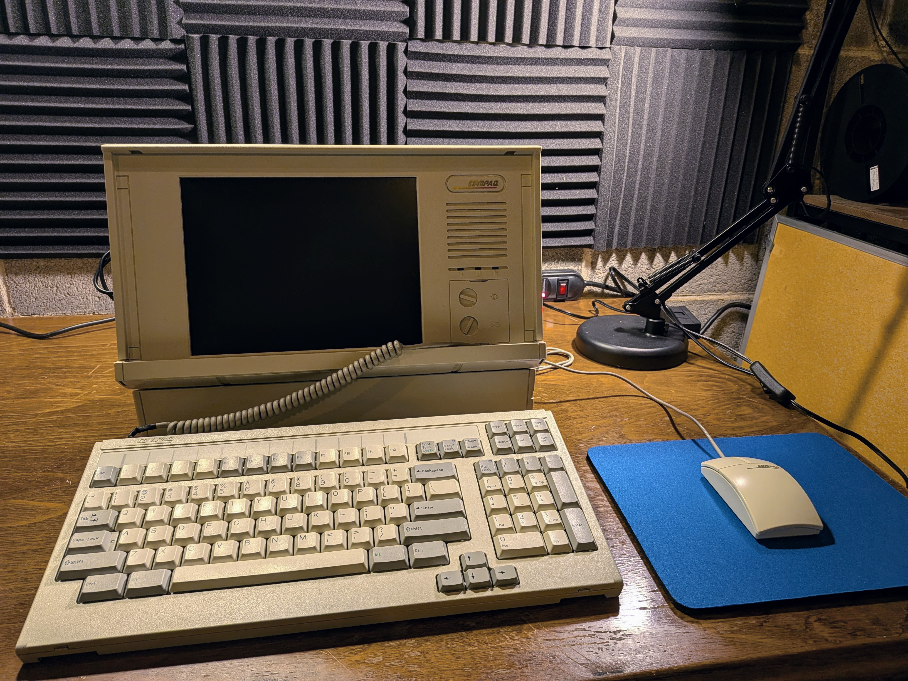

Ongoing restoration of my Compaq Portable 486c. Luggable 486-era PC with a built-in 10.4" TFT display.

## Machine Specifications

| Component | Original | Upgraded |
|-----------|----------|----------|
| **CPU** | IBM Blue Lightning DX2-66 MHz | AMD Am5x86-P75 (133 MHz, 4x multiplier) |
| **RAM** | 4 MB | 32 MB |
| **Hard Drive** | 120 MB Conner 3.5" | This still works! |
| **Display** | Sharp LQ10D016 10.4" TFT (640×480) | Sharp LQ104V1DG51 10.4" TFT (640×480) |
| **Audio** | None | Sound Blaster AWE32 CT3900 (EISA slot 1) |
| **Expansion** | 2× EISA slots | SCM ISAC2PR10 PCMCIA adapter (EISA slot 2) |
| **PCMCIA** | -- | Cisco Aironet 350 (WiFi) + SanDisk CF adapter |
| **Floppy** | 3.5" floppy drive | -- |
| **Architecture** | Small backplane with CPU card + RAM | -- |

## Restoration Log

### 1. PSU Rebuild

PSU worked but stank like leaking caps. Without stable power, nothing else matters. I can replace caps here and there but didn't trust myself to do the whole thing, so I sent it to [GiGaBiTe](https://forum.vcfed.org/index.php?members/gigabite.35162/) on VCFed. They replaced the bridge rectifier, all electrolytics, the DPST power switch, and the cooling fan. Power rails are rock stable now.

**[Full PSU rebuild documentation →](/projects/compaq-486c-restoration/psu/)**

### 2. Screen Replacement

Original Sharp LQ10D016 was dead on arrival -- leaking capacitors destroyed the ribbon cables. Very common with these. Found a Sharp LQ104V1DG51 replacement, built a custom pin adapter cable, wired up a BLANK-to-Data-Enable delay circuit on the video card, and swapped in a modern CCFL inverter for the backlight.

**[Full screen replacement documentation →](/projects/compaq-486c-restoration/screen/)**

### 3. Keyboard Restoration

Keycaps were yellowed from UV-degraded ABS. Retrobrighted them using the heat method -- SalonCare 40 Volume Creme Developer (12% hydrogen peroxide) on the stove at low heat. Heat replaces UV as the catalyst and you get more even results since everything is submerged. Technique from [The 8-Bit Guy](https://www.youtube.com/@The8BitGuy).

Keyboard cable is proprietary and gets brittle with age. Mine was damaged but still usable after taping it up. Planning a custom coiled replacement at some point.

**[Full keyboard restoration documentation →](/projects/compaq-486c-restoration/keyboard/)**

### 4. Hard Drive Replacement (Future)

The original 120 MB Conner 3.5" hard drive is, against all odds, still working perfectly. This thing has been spinning since the early '90s and shows absolutely no signs of stopping. It owes me nothing. Every time I power on the machine I half-expect to hear the click of death, but instead it just boots right up like it's 1993 and it has something to prove. I love it.

When the day inevitably comes - and it will, because spinning rust doesn't live forever no matter how stubborn it is - the plan is to replace it with an **IDE-to-CompactFlash adapter**. Dead silent, no moving parts, boots faster, and the CF card can be swapped out on a modern machine for easy file transfers. It's the most popular hard drive replacement in the retro community for good reason.

But until that drive actually dies, I refuse to fix what isn't broken. I will not be the one to end its career. That Conner has earned its retirement on its own terms.

## Beyond Restoration

### Processor Upgrade to AMD Am5x86-P75

Swapped the IBM Blue Lightning DX2-66 for an **AMD Am5x86-P75** (AMD-X5-133ADZ). Drop-in Socket 3 upgrade, Pentium-75 equivalent performance at 133 MHz. Went with the ADZ variant for its 85°C max case temp -- only a passive heatsink fits in this case. No clock multiplier jumper on the Compaq, so I had to manually ground pin R17 (CLKMUL) on the CPU to get the 4x multiplier working.

**[Full CPU upgrade documentation →](/projects/compaq-486c-restoration/cpu/)**

### EISA Expansion

Two EISA card slots. Not a lot of real estate, so every slot counts.

#### Sound Blaster AWE32 IDE/MKP CSP (CT3900)

No onboard audio, so one slot goes to a **Creative Sound Blaster AWE32 (CT3900)**. Full Sound Blaster and AdLib compatibility, OPL3 FM synthesis, EMU8000 wavetable with 512 KB sample RAM. Went with the CT3900 specifically because it's not Plug and Play -- in 1994, "Plug and Play" mostly meant "Plug and Pray." Jumpers, works at boot, no drama.

**[Full Sound Blaster documentation →](/projects/compaq-486c-restoration/soundblaster/)**

#### SCM ISAC2PR10 ISA PCMCIA Adapter

PCMCIA was designed for laptops, but nobody said a 25-pound luggable couldn't crash the party. Second slot holds an ISA PCMCIA adapter (SCM Microsystems ISAC2PR10, Vadem VG-469 chipset) giving me dual PC Card slots. One EISA slot, two hot-swappable expansion slots. Good trade.

Currently running:

- **Cisco Aironet 350 (AIR-PCM350)** -- 802.11b WiFi
- **SanDisk CF adapter** -- CompactFlash-to-PCMCIA, hot-swaps in DOS and Windows 3.1, doubles as easy file transfer

Previously had a Xircom RealPort Ethernet 10/100 (RE-100) but it hogged both slots. Greedy.

**[Full PCMCIA adapter documentation →](/projects/compaq-486c-restoration/pcmcia/)**

---

## Datasheets

- [AMD Am5x86 Microprocessor Family (PDF)](/docs/compaq-486c/AM5x86_Datasheet.pdf)
- [Brooktree Bt471/476/478 RAMDAC (PDF)](/docs/compaq-486c/BT471_RAMDAC_Datasheet.pdf)
- [Compaq Display Pinout Mapping (PDF)](/docs/compaq-486c/Compaq_Display_Pinout_Mapping.pdf)
- [Sharp LQ104V1DG51 Replacement Display (PDF)](/docs/compaq-486c/LQ104V1DG51_Datasheet.pdf)
- [Sharp LQ10D011 Reference Display (PDF)](/docs/compaq-486c/LQ10D011_Datasheet.pdf)
- [Creative AWE32 Getting Started Guide (PDF)](/docs/compaq-486c/AWE32_Getting_Started.pdf)

## References

- [VCFed Forum Thread](https://forum.vcfed.org/index.php?threads/compaq-portable-486c-restore-and-upgrade.73098/) -- My restoration thread with discussion and community Q&A
- [DOSReloaded Forum Thread (German)](https://dosreloaded.de/forum/thread/7354-compaq-portable-486c-66/?postID=254850#post254850) -- Detailed write-up by *Beckenrandschwimmer* covering the display replacement with oscilloscope measurements and circuit design
- [Compaq Portable 486 Pictures & Firmware (Bitsavers)](http://bitsavers.org/pdf/compaq/Compaq_Portable_486/pictures/) -- Reference photos and firmware dumps
- [Source Repository](https://github.com/k0bura/compaq-portable-486c-restoration) -- Full documentation with datasheets and additional resources
