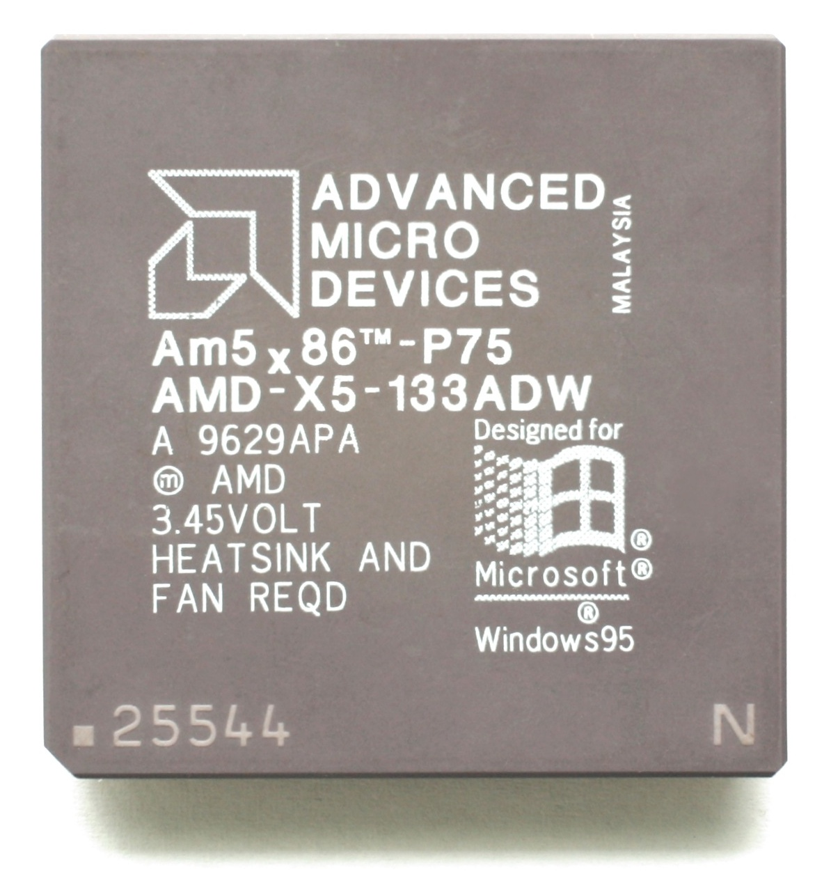

## Original CPU -- IBM Blue Lightning DX2

Mine came with an **IBM Blue Lightning DX2** (486-V266GA). Clock-doubled 486, 66 MHz (33 MHz bus, 2x multiplier). Machine wasn't branded as the 66 MHz model so someone upgraded it before I got it. The Blue Lightning was IBM's own 486 -- write-back 16 KB internal cache, pin-compatible with the Intel 486DX2-66.

## Upgrade -- AMD Am5x86-P75 (AMD-X5-133ADZ)

Drop-in Socket 3 upgrade. Pentium-75 equivalent performance (hence "P75"), fully compatible with 486 motherboards. 133 MHz on a 4x multiplier off the 33 MHz bus, 16 KB write-back L1 cache, only ~3W. See [AM5x86 Datasheet (PDF)](/docs/compaq-486c/AM5x86_Datasheet.pdf).

### Why the ADZ Variant

Several variants, all 133 MHz but with different max case temp ratings:

| Variant | Part Number | Max Case Temp | Notes |
|---------|-------------|---------------|-------|
| **ADW** | AMD-X5-133ADW | 55° C | Earliest production, requires active cooling |
| **ADY** | AMD-X5-133ADY | 75° C | Mid-range thermal rating, rare |
| **ADZ** | AMD-X5-133ADZ | 85° C | Later production, preferred for compact builds |

**ADZ is the one I need.** Compact case, limited airflow, no room for a fan -- heatsink only. ADW's 55°C limit would get exceeded easy. ADZ's 85°C gives me plenty of headroom on passive cooling.

You can see it on the chips -- ADW is stamped "HEATSINK AND FAN REQD", ADZ has no such warning:

The suffix also hints at what the chip can actually do. Enthusiasts figured out it corresponds to the real designed speed:

| Suffix | Marketed Speed | Actual Capability |
|--------|---------------|-------------------|
| ADW | 133 MHz (33 x 4) | 133 MHz |
| ADY | 133 MHz | 150 MHz (50 x 3) |
| ADZ | 133 MHz | 160 MHz (40 x 4) |

AMD never released a 160 MHz part -- feared it would cannibalize their upcoming K5 (5K86). The K5 ended up being a total flop. Most people who bought the ADZ "133 MHz" ran it at 160 MHz anyway.

### Enabling the 4x Multiplier -- CLKMUL Pin R17

Socket 3 only supported 2x and 3x multipliers. AMD made the Am5x86 reinterpret 2x as 4x internally. Controlled by **CLKMUL pin R-17** on the 168-pin PGA:

| CLKMUL (R17) State | Multiplier |
|---------------------|-----------|
| High (Vcc) or floating | 3x (99 MHz on 33 MHz bus) |
| Low (Vss / ground) | 4x (133 MHz on 33 MHz bus) |

On boards with a multiplier jumper, set it to "2x" and pin R17 gets grounded -- Am5x86 quadruples instead. **My Compaq has no multiplier jumper.** Pin floats, CPU defaults to 3x (99 MHz).

Fix: **manually ground pin R17.** Soldered a thin wire from R17 to a nearby Vss pin on the chip. Without this the CPU boots fine but only runs at 99 MHz. Spent a while confused about the benchmarks before I figured it out.

**TODO:** Add photo of the R17 pin ground mod.
