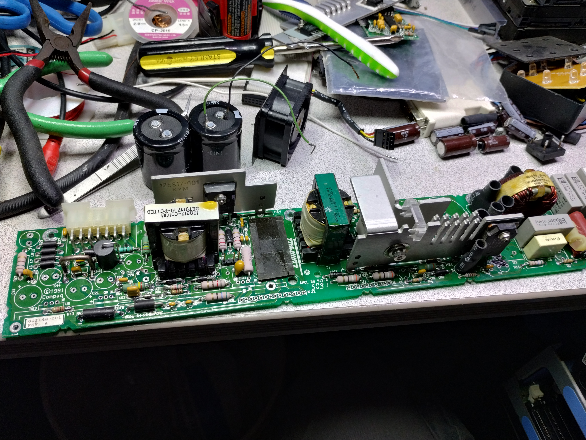
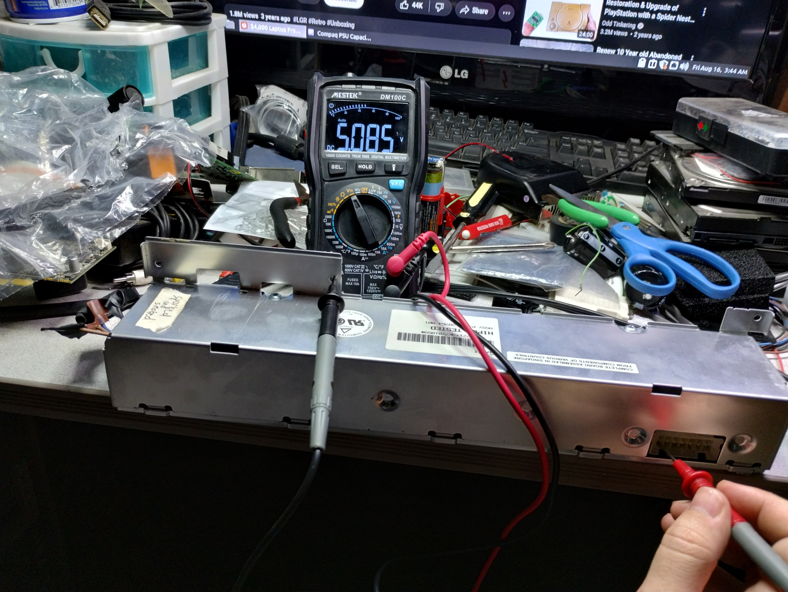

## Overview

The original power supply in the Compaq Portable 486c is a common failure point. Aging electrolytic capacitors dry out and lose capacitance, leading to voltage droop, ripple, and eventually failure to start. A full recap restores the PSU to reliable operation.

## Recap

The PSU board was removed from its enclosure and all electrolytic capacitors were replaced. The board was cleaned of any electrolyte residue before installing the new caps.

## Voltage Verification

After recapping, the PSU was tested with a multimeter to verify clean output on all rails before reconnecting to the motherboard.

**12V rail** — Reading 12.11V, and **5V rail** — Reading 5.085V, well within spec.

## Reassembly

The rebuilt PSU board reinstalled in its metal enclosure, ready to go back into the case.

