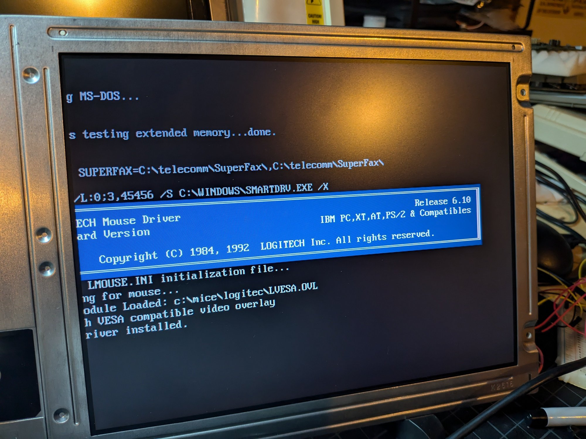
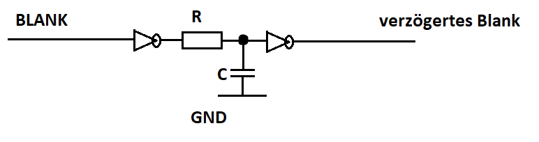
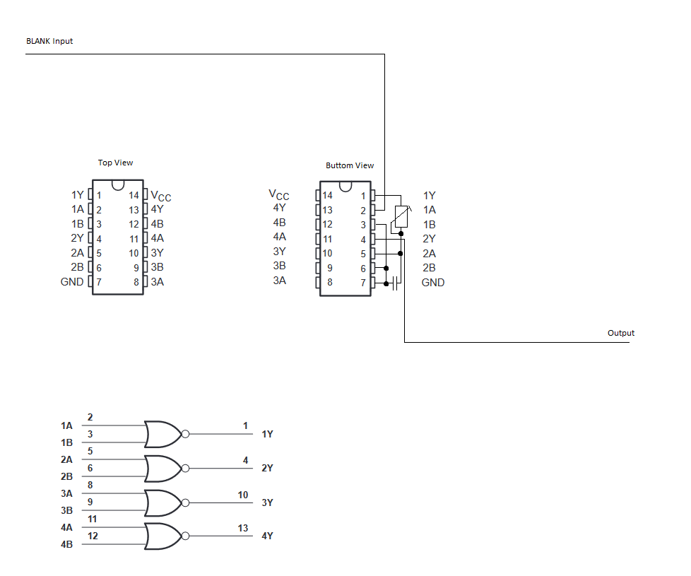
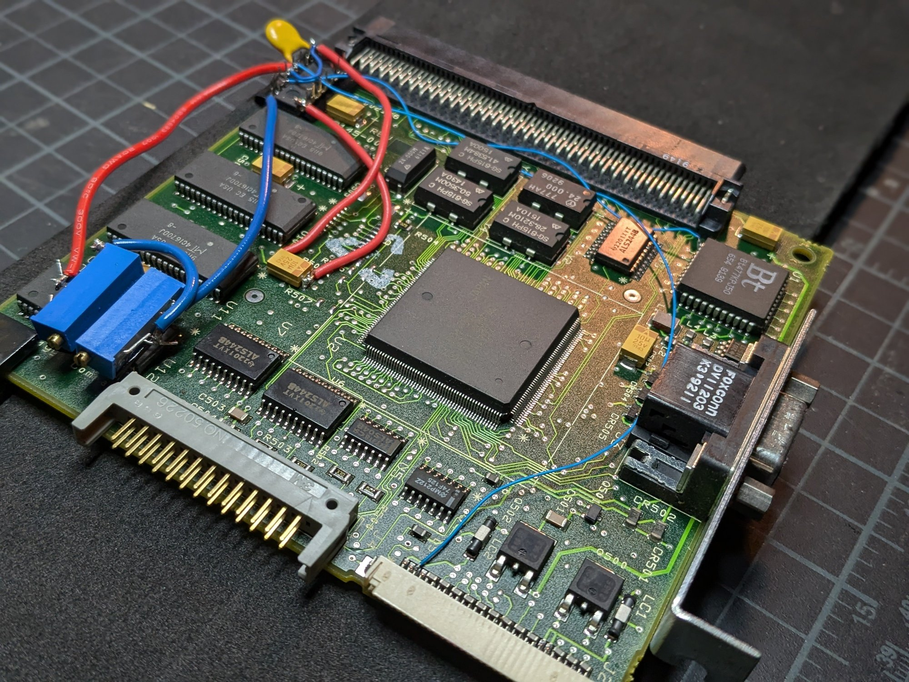

## Overview

The original 10.4" TFT display (Sharp LQ10D016) in the Compaq Portable 486c is a common failure point. Electrolyte leakage from aging capacitors corrodes the delicate ribbon cables connecting the panel's driver ICs, eventually destroying the display. No OEM replacement exists, and Sharp will not provide the original datasheet. This document covers how to replace the original panel with a modern 10.4" 640×480 TFT.

## Original Display — Sharp LQ10D016

No official datasheet exists for the LQ10D016. The pinout was reverse-engineered by *Beckenrandschwimmer* on [DOSReloaded](https://dosreloaded.de/forum/thread/7354-compaq-portable-486c-66/?postID=254850#post254850), who painstakingly probed the video card output with an oscilloscope and various test patterns to map out each signal. This project would not have been possible without that work. The closest available datasheet is for the **Sharp LQ10D011** — it shares the same 3-bit-per-channel color architecture, the same horizontal display start at clock 144, and identical timing characteristics. The LQ10D011 uses a 22-pin interface (CN1) while the Compaq's LQ10D016 uses a custom 30-pin ribbon cable, but the signal types and timing are the same. Between the LQ10D011 datasheet and *Beckenrandschwimmer's* oscilloscope work, we have a complete picture of the video interface. See [LQ10D011 Datasheet (PDF)](/docs/compaq-486c/LQ10D011_Datasheet.pdf).

Key characteristics of the original display:

| Parameter | Value |
|-----------|-------|
| Model | Sharp LQ10D016 |
| Size | 10.4" diagonal |
| Resolution | 640×480 |
| Color depth | 3-bit per channel (9-bit total, 512 colors) |
| Backlight | Heated-cathode fluorescent tubes (HCFT) |
| Sync method | H-Sync + V-Sync (no Data Enable) |
| H-Sync display start | Clock 144 |
| Video modes | 480 lines (60 Hz), 400 lines (70 Hz), 350 lines (70 Hz) |
| Pixel clock | 25.175 MHz |

## My Replacement — Sharp LQ104V1DG51

After an exhaustive search and lots of trial and error, I settled on a Sharp **LQ104V1DG51** — a modern 10.4" 640×480 panel. See [LQ104V1DG51 Datasheet (PDF)](/docs/compaq-486c/LQ104V1DG51_Datasheet.pdf). The original goal was to find a panel with a fixed horizontal display start at clock 144 - matching the Compaq's video card timing - whether or not it had a Data Enable signal. That would have avoided building a custom delay circuit entirely. But no such panel existed, or if it did, it didn't support the 400-line and 350-line DOS video modes.

The LQ104V1DG51 was the best compromise. It natively supports 480-line, 400-line, and 350-line modes - the display mode is selected by the polarity combination of the H-Sync and V-Sync signals, which is exactly how the Compaq's video card signals the mode. This means all three DOS video modes work without any additional circuitry. The trade-off is needing the BLANK-to-DE delay circuit to handle the horizontal alignment.

| Mode | H-Sync | V-Sync |
|------|--------|--------|
| 480 lines | Negative | Negative |
| 400 lines | Negative | Positive |
| 350 lines | Positive | Negative |

*Beckenrandschwimmer* successfully used a **Sharp LQ10D421**, and a third person used an **LQ104V1DG11**. The approach is the same for all of these.

### Key Differences from the Original

| | Original (LQ10D016) | Replacement (LQ104V1DG51) |
|---|---|---|
| Connector | Proprietary 30-pin (undocumented) | Standard 31-pin TTL |
| Color depth | 3-bit/channel (512 colors) | 6-bit/channel (262,144 colors) |
| Backlight | HCFT (heated cathode), 12V supply | CCFL (cold cathode), 5V supply |
| Data Enable | Not required | Required (ENAB pin 27) |
| H-Sync display start | Clock 144 | Clock 104 |

### Challenges

There are several issues to solve when swapping the display:

1. **Proprietary 30-pin connector** — The Compaq uses a proprietary 30-pin ribbon cable to connect the video card to the display. There is no documentation for this connector — the pinout had to be reverse-engineered. The replacement display uses a standard 31-pin interface, so an adapter cable is needed to bridge the two.
2. **40-pixel horizontal shift** — The new display starts drawing 40 clock cycles earlier than the original, shifting the image left.
3. **No Data Enable signal** — The Compaq's video card doesn't output a DE signal, but the new display requires one.
4. **Color depth mismatch** — The video card outputs 3 bits per color; the new display expects 6-8 bits.
5. **Backlight incompatibility** — Completely different inverter requirements.
6. **70 Hz DOS mode** — New displays may not handle the 400-line/70 Hz and 350-line/70 Hz modes used in DOS. The image will wrap/duplicate at the bottom (the display I found supports it).

## Pin Mapping

The full pin-by-pin mapping between the old 30-pin display connector and the new 31-pin connector is documented in [Compaq Display Pinout Mapping (PDF)](/docs/compaq-486c/Compaq_Display_Pinout_Mapping.pdf).

Key wiring notes:

- The original display's **3 color bits per channel** (e.g., RED LSB/RED/RED MSB) map to the **upper 3 bits** of the new display's 6-bit channels (R3-R5, G3-G5, B3-B5). The lower bits (R0-R2, G0-G2, B0-B2) are tied to **GND**.
- **Pin 28** on the old connector was unused (how lucky is that?!) - this is where the generated Data Enable signal is routed to the new display.
- **H-Sync** (old pin 4) and **V-Sync** (old pin 6) connect to the new display normally.
- **Dot Clock** (old pin 2, 25 MHz) connects to **DCLK** (new pin 2).
- Power: old pin 7/8 (+5V) → new pin 28/29 (VCC). Old pin 30 (+12V) isn't used as the display doesn't need a 12V source.

## Adapter Cable

The replacement display has a standard 31-pin TTL interface, but the Compaq's video card outputs through its proprietary undocumented 30-pin ribbon cable — there's no way to plug one into the other directly. Rather than hand-soldering 30 individual wires, I used a **40-pin to 31-pin TTL LVDS cable with a breakout board** ([eBay item 173579595077](https://www.ebay.com/itm/173579595077?var=472260346154)). I could have custom made one for exactly 30 pins we need, but this worked and is off the shelf. The 31-pin end plugs directly into the new display, and the breakout board on the other end has header pins that can be soldered to the Compaq's original 30-pin ribbon cable connector. This bridges the proprietary Compaq interface to the standard display connector cleanly and reliably.

**[Full 40-pin connector pinout →](/projects/compaq-486c-restoration/40-pin-pinout/)**

## Data Enable / Horizontal Alignment Circuit

The new display requires a **Data Enable (DE)** signal and starts drawing at clock 104 instead of 144, causing a 40-pixel horizontal offset. The solution (originally devised by *Beckenrandschwimmer* on [DOSReloaded](https://dosreloaded.de/forum/thread/7354-compaq-portable-486c-66/?postID=254850#post254850)) uses the **BLANK signal** from the graphics card's RAMDAC as a delayed Data Enable.

### The Problem

The Compaq's Cirrus Logic video controller outputs standard VGA sync signals (H-Sync, V-Sync) and a BLANK signal from the RAMDAC. The video card uses a **Brooktree Bt47x series RAMDAC** (Bt471/476/478 family) — the BLANK* output is at **pin 7** on the 44-pin PLCC package. This is a TTL-compatible signal that goes low during the blanking interval (see Tables 4-6 in the datasheet). See [BT471 RAMDAC Datasheet (PDF)](/docs/compaq-486c/BT471_RAMDAC_Datasheet.pdf).

The original display used H-Sync and V-Sync directly to know when to start drawing pixels, with a fixed horizontal display start at clock cycle 144 after H-Sync.

Modern replacement displays don't use H-Sync for pixel positioning - they require a **Data Enable (DE)** signal that goes high during the active display period. The new display also expects pixel data to begin at clock cycle 104. Since the Compaq's video card sends pixel data starting at clock 144, we need to delay the DE signal by exactly 40 clock cycles (approximately 1.58 µs at 25.175 MHz) to align the image.

### RC Delay Approach

The circuit uses a simple RC (resistor-capacitor) delay network sandwiched between two inverter stages. The BLANK* signal from the RAMDAC is active-low during the blanking interval — when BLANK* is high, the display is in the active region (see Tables 4-6 in the Bt471 datasheet). It gets inverted, delayed through the RC network, then inverted again to produce a properly timed DE output.

The delay is determined by the RC time constant: **τ = R × C**. With a 10 kΩ trimmer pot and a 22 pF capacitor, the adjustable range covers the ~1.58 µs delay needed. Turning the trimmer shifts the image left or right on the display, pixel by pixel.

### 74AS02 NOR Gate Implementation

The **SN74AS02N** is a quad 2-input NOR gate IC. A NOR gate with both inputs tied together acts as an inverter (any high input → low output). We use two of the four available gates as the two inverter stages in the delay circuit. The other two gates are unused (inputs tied to GND per standard practice).

The diagram above shows the physical wiring on the video card. The 74AS02 is soldered dead-bug style (upside down) directly onto the video card PCB. Key connections:

- **BLANK input** is tapped from **pin 7 (BLANK\*)** on the Bt47x RAMDAC on the video card with a wire
- **Gate 1** (pins 2+3 → pin 1): Both inputs tied to BLANK. Output is inverted BLANK.
- **RC network**: Connected between Gate 1 output (pin 1) and Gate 2 input. The trimmer pot (R) and capacitor (C) to GND create the adjustable delay.
- **Gate 2** (pins 5+6 → pin 4): Both inputs tied to the delayed signal. Output is the final DE signal, now re-inverted and delayed.
- **Pin 14** (VCC): +5V power
- **Pin 7** (GND): Ground
- **Output** (pin 4): Routed to the unused **pin 28** of the original 30-pin display cable, which connects to the DE input on the new display.

The "Advanced Schottky" (AS) variant is chosen for its fast propagation delay (~1.5 ns), which keeps the edges of the DE signal sharp at 25 MHz pixel clock speeds. Standard 74LS or 74HC variants would add too much propagation delay and edge degradation.

### Components

| Part | Value | Notes |
|------|-------|-------|
| IC | SN74AS02N | Quad 2-input NOR gate, two gates used as inverters |
| C1 | 22 pF | Timing capacitor (150 pF also works but gives coarser adjustment) |
| R1 | Bourns 3006P-1-222LF (2.2 kΩ) | Precision multi-turn trimmer pot — fine-tunes the delay to align the image horizontally ([Mouser](https://www.mouser.com/ProductDetail/Bourns/3006P-1-222LF?qs=RwhcuQjtsMp2J7D9glJLaw%3D%3D)) |
| C_bypass | 220 nF ceramic | Decoupling cap directly across IC VCC/GND pins |

### Calibration

1. Boot the machine to a known pattern (a DOS text prompt works fine — the left edge of the `C:\>` cursor is a clean vertical reference)
2. Adjust the trimmer slowly until the image is centered in the display with no black bar on either side
3. The delay is approximately 1.58 µs for the 40-pixel offset at 25.175 MHz

### My Implementation Notes

I added two trimmer pots instead of one to allow finer control over the signal. When I first protyped this, the signal wasn't clean and finer tuning was required, but I kept both anyways. One pot adjusts the main RC delay for horizontal alignment, while the second pot fine-tunes the signal to get a clean, stable image. Both pots are visible in the breadboard and video card photos below.

For +5V and GND, I used a multimeter to probe the video card's components to find suitable tap points with a solid +5V and GND connection near where the 74AS02 is mounted. The yellow 220 nF ceramic disc bypass cap is soldered directly across the IC's VCC and GND pins (pin 14 and pin 7).

I placed the components down at the bottom where there is airflow from the case exhaust fan (after it's installed).

My PSU was already rebuilt, so I had a clean, stable 5V rail available to power the 74AS02 directly. This simplified my build compared to the DOSReloaded approach, where the author tapped 12V and regulated it down with an LM78L05 because his 5V rail had too much ripple.

**If your 5V rail is noisy** (common with original PSUs), follow the DOSReloaded approach:
- Tap the 12V rail and regulate down to 5V with an LM78L05
- 10Ω resistor + 1000 µF cap before the regulator input
- 470 µF cap on the output
- Reverse-biased protection diode across the regulator output

**Regardless of your 5V source:**
- 220 nF bypass cap directly across the IC power pins is mandatory (not in my pics, it was added later)
- Mount the IC away from heat sources; temperature drift can shift the image up to 4 pixels

## Backlight

The original HCFT backlight inverter is incompatible with the CCFL tubes in the new display. I used a **modern dual CCFL inverter board** ([eBay item 405140078781](https://www.ebay.com/itm/405140078781?var=675230324995)) wired to the 12V supply from the original inverter board.

**TODO:** Wire the new inverter's dimmer input to the Compaq's front-panel brightness potentiometer. Currently brightness is not adjustable from the front panel.

**TODO:** Track down the exact inverter model number and datasheet, and take photos of the installed inverter board.

*Note: The DOSReloaded build used a CCFL Driver 104PW201, which conveniently accepts a 10kΩ pot — matching the original. That approach gives front-panel brightness control out of the box.*

## Physical Mounting

The replacement LQ104V1DG51 is physically much smaller than the original LQ10D016 because it uses modern CCFL backlights instead of the bulky heated-cathode fluorescent tubes in the original. The slimmer profile means the new panel doesn't fill the original display cavity in the case. I superglued the panel into the case to hold it securely in place.

**TODO:** Add photos of the display mounted in the case.

## Results

*It's not a vintage computing project until you run DOOM on it. I don't make the rules - the retro community bylaws are very clear on this. No DOOM screenshot, no credibility.*

## Resources

- [DOSReloaded Forum Thread (German)](https://dosreloaded.de/forum/thread/7354-compaq-portable-486c-66/?postID=254850#post254850) — *Beckenrandschwimmer's* original write-up with oscilloscope measurements and circuit diagrams
- [VCFed Forum Thread](https://forum.vcfed.org/index.php?threads/compaq-portable-486c-restore-and-upgrade.73098/) — My restoration thread with discussion and community Q&A
- [40-pin to 31-pin TTL cable (eBay)](https://www.ebay.com/itm/173579595077?var=472260346154) — Adapter cable used for wiring
- [Dual CCFL Inverter Board (eBay)](https://www.ebay.com/itm/405140078781?var=675230324995) — Backlight inverter used
